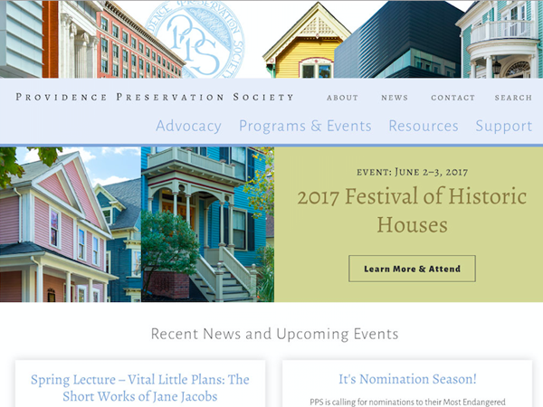

# Providence Preservation Society Website 2017




## Description
A custom WordPress theme, created for the Providence Preservation Society.


## Requirements

- [WordPress](https://wordpress.org/)
- [compass](http://compass-style.org/install/)
- [npm](https://www.npmjs.com/)

## Installation
- clone the repo into your wp-content/themes folder
- run `npm install`
- to track Sass changes, run `compass watch` from the root directory

## Notes

The CSS on this project was written in Sass and compiled using Compass. The CSS files are not tracked in this repo, so you will need to run the compiler to have the website not look terrible in your environment. Please do not edit the CSS files directly!

### Compile locally
```bash
$ compass watch
```

From the root of the theme folder (J's root):

```bash
$ cd vvv/www/wordpress-default/public_html/wp-content/themes/pps
```